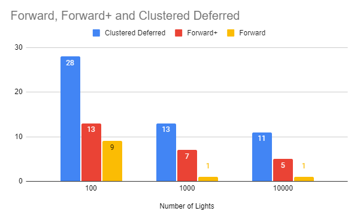

WebGL Forward+ and Clustered Deferred Shading
======================

**University of Pennsylvania, CIS 565: GPU Programming and Architecture, Project 5**

* Raymond Yang
	* [LinkedIn](https://www.linkedin.com/in/raymond-yang-b85b19168)
	* Tested on: 
		* 10/31/2021
		* Windows 10
		* NVIDIA GeForce GTX 1080 Ti. 
	* Submitted on: 10/31/2021

## Live Online

## Demo Video/GIF

  

## Introduction 
The objective of this project was to implement 2 renderers, Forward+ rendering and Cluster Deferred rendering. To use Forward+ and Cluster Deferred, renderers maintained a `_clusterTexture` data structure. The camera frustrum is partitioned by slices in x, y, and z axes. Each partition is called a cluster. The `_clusterTexture` structure is indexed by `(i, j) + k`. `i` is the `ith` element, `j` is the `jth` component of `ith` element. `k` is the `kth` float of the `jth` component. The first float of an index details the number of lights in the cluster. All following floats are the index of lights in `scene.lights`. 

According to [3dgep](https://www.3dgep.com/forward-plus/):
* Forward rendering works by rasterizing each geometric object in the scene. During shading, a list of lights in the scene is iterated to determine how the geometric object should be lit. 
* Forward+ (also known as tiled forward shading) is a rendering technique that combines forward rendering with tiled light culling to reduce the number of lights that must be considered during shading.
* Clustered Deferred rendering takes place over two iterations of the rendering pipeline. Using two iterations, we cull additional vertices that would not be visible, thus eliminating the number of vertices we must compute on. 

## Performance Analysis
Higher is better (fps):

  

Both Forward+ and Clustered Deferred retain better performance as number of lights are increased. Both demonstrate significant improvement

## Project Limitations
The current submission of this project lacks the following: 
* Implementation of Part 2 (additional post processing effect and optimizations).
* There is significant issue with visible tiling and artifacting that would suggest `updateClusters()` is implemented incorrectly. I think a better approach, rather than trying to emulate a `ProjectionMatrix`, is to directly pass `ViewProjectionMatrix` into `updateClusters()`. Tiling issue becomes incredibly obvious once number of lights are increased. This may be a product of problem detailed below. 
* I believe my computer does not fully utilize my GPU. Either I have setup my system incorrectly or there is some other issue. This is obvious in the low FPS even at low numbers of lights. 

### Credits

* [Three.js](https://github.com/mrdoob/three.js) by [@mrdoob](https://github.com/mrdoob) and contributors
* [stats.js](https://github.com/mrdoob/stats.js) by [@mrdoob](https://github.com/mrdoob) and contributors
* [webgl-debug](https://github.com/KhronosGroup/WebGLDeveloperTools) by Khronos Group Inc.
* [glMatrix](https://github.com/toji/gl-matrix) by [@toji](https://github.com/toji) and contributors
* [minimal-gltf-loader](https://github.com/shrekshao/minimal-gltf-loader) by [@shrekshao](https://github.com/shrekshao)
